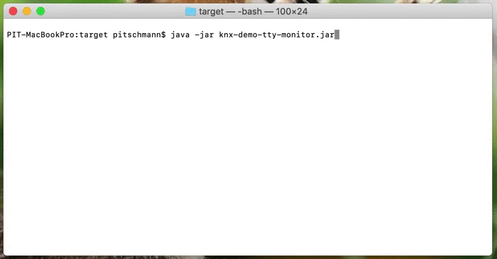
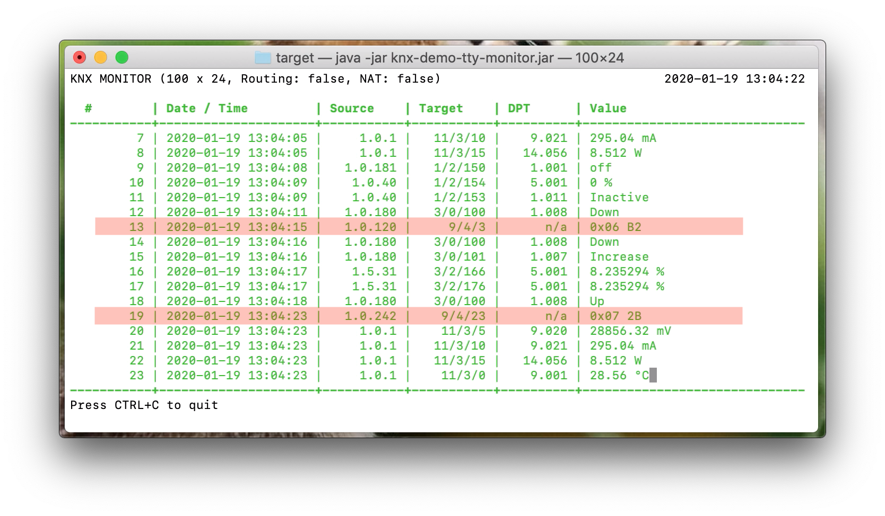
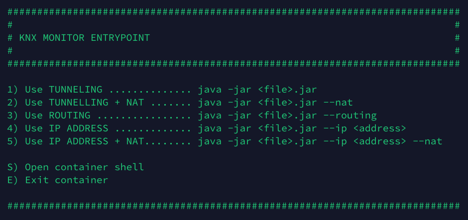

# Demo Application: KNX TTY Monitor

This is a demo application to demonstrating how to work / implement a project
using [knx-link](/knx-link) and the goal is to visualize the KNX monitoring, 
audit the KNX traffic to a JSON file and write the statistic of all KNX packets 
in a 5 minutes interval.

For demo purposes the KNX Monitor only supports terminal that is ANSI escape code
capable (e.g. Linux, MacOS).

It includes three plugins:
* KNX Monitoring
  * Terminal visualization of KNX traffic (similar to the _Group Monitor_ in ETS from KNX Association)
* KNX File Auditing (re-used: [knx-core-plugin-audit](https://github.com/pitschr/knx-link/tree/master/knx-core-plugins/audit))
  * Auditing the KNX packets in JSON structure that can be used for further analysis 
* KNX Statistic (re-used: [knx-core-plugin-statistic](https://github.com/pitschr/knx-link/tree/master/knx-core-plugins/statistic))
  * Textual format of statistic to see how many KNX packets and which type of KNX packets were sent/received 

## How to use it?

**Main Class:** [`li.pitschmann.knx.examples.tty.Main`](src/main/java/li/pitschmann/knx/examples/tty/Main.java)

#### Arguments

| Name&nbsp;&nbsp;&nbsp;&nbsp;&nbsp;&nbsp;&nbsp;&nbsp;&nbsp;&nbsp;&nbsp;&nbsp;&nbsp;&nbsp;&nbsp;&nbsp;&nbsp;&nbsp;&nbsp;&nbsp;&nbsp;&nbsp;&nbsp;&nbsp;&nbsp;&nbsp;&nbsp;&nbsp; | Default&nbsp;Value&nbsp;&nbsp;&nbsp;&nbsp;&nbsp;&nbsp;&nbsp;&nbsp;&nbsp; | Description |
| ---- | ------------- | ----------- |
| `-t <number>` <br> `--time <number>` | `3600` (=1 hour) | The time in seconds how the KNX monitor should run. |
| `-p <path>` <br> `--project <path>` | _latest *.knxproj in the folder_ | The path to _*.knxproj file_ that is created by the ETS to encode the values in correct data point types. In case there are more than one _*.knxproj_ in the working directory, the most recent _*.knxproj file_ (based on timestamp) will be taken. <br><br> If no _*.knxproj file_ is provided then all values are displayed in raw bytes |
| `-g` <br> `--generate-fake-data` | `false` | Indicates if the fake data should be generated for demo purposes |

#### Examples
```shell script
# Tunneling (auto-discovery)
java -jar knx-demo-tty-monitor.jar

# Tunneling (auto-discovery with NAT)
java -jar knx-demo-tty-monitor.jar --nat

# Tunneling (IP Address)
java -jar knx-demo-tty-monitor.jar --ip 192.168.1.16

# Tunneling (IP Address with NAT)
java -jar knx-demo-tty-monitor.jar --ip 192.168.1.16 --nat

# Routing
java -jar knx-demo-tty-monitor.jar --routing

# Tunneling (auto-discovery) and limited to 5 minutes
java -jar knx-demo-tty-monitor.jar -t 300
java -jar knx-demo-tty-monitor.jar --time 300

# Tunneling (auto-discovery) with specific *.knxproj file located at ~/my-house.knxproj
java -jar knx-demo-tty-monitor.jar -p ~/my-house.knxproj
java -jar knx-demo-tty-monitor.jar --project ~/my-house.knxproj

# Tunneling (auto-discovery) with generating fake data
java -jar knx-demo-tty-monitor.jar -g
java -jar knx-demo-tty-monitor.jar --generate-fake-data
```

## Demo

*Talk is cheap, demo it!* I launched the KNX monitor using auto-discovery with a `*.knxproj` 
in the same working directory:
```
java -jar knx-demo-tty-monitor.jar
```


In case the data point type of group address is not known in the KNX project file created 
by ETS the values are displayed in raw data format, see highlighted rows.



## Now I want to try out it by myself

### Linux

You're lucky! I have created a ready-to-use container image for you. On my machine I am using 
the [podman](https://podman.io/), but you can also use the docker; in this case just replace the command `podman` with the `docker`

(Only if necessary) If you are using firewall then either disable it or configure it. 
Here an example for *firewalld* (via `firewall-cmd`):

```
# Create KNX service for firewalld
firewall-cmd --permanent --new-service=knx
firewall-cmd --permanent --service=knx --set-description="KNXnet/IP is a part of KNX standard for transmission of KNX telegrams via Ethernet"
firewall-cmd --permanent --service=knx --set-short=KNX
firewall-cmd --permanent --service=knx --add-port=3671/udp
# Ports 40001-40003 are necessary only when you want to communicate without NAT
firewall-cmd --permanent --service=knx --add-port=40001-40003/udp
```
then add it to firewalld (remove `--permanent` if you want to add the KNX service temporarily only)
```
firewall-cmd --reload
firewall-cmd --permanent --add-service=knx
```
    
##### Option 1: Container with host networking

1. Pull & run the image using:
    ```
    podman run --rm -it --net host docker.io/pitschr/knx-demo-tty-monitor
    ```
1. You should see a menu with several options like, select one:
   
1. To stop the KNX monitor application just press `CTRL` + `C` and if you want to quit 
the docker container just enter `exit` in the terminal.
1. If you want to test KNX Monitoring with `*.knxproj` then use the `--volume` argument so that 
your KNX project files will be visible to container as well:
    ```
    podman run --rm -it --net host --volume <your-path-to-knx-projects>:/mnt/host:Z docker.io/pitschr/knx-demo-tty-monitor
    ```
    
##### Option 2: Container without host networking (use bridge) 

There are some limitations when using container, which brings a better isolation, but 
also some limitations in e.g. UDP multicasting. With this approach you need to connect
the KNX Net/IP device using IP Address and NAT.

1. Pull & run the image using:
    ```
    podman run --rm -it docker.io/pitschr/knx-demo-tty-monitor
    ```
1. Launch with e.g.
    ```
    java -jar knx-demo-tty-monitor.jar --ip 192.168.1.16 --nat
    ```

##### Option 3: Start KNX monitor without container platform

Alternatively, you can also launch the KNX monitor using [knx-demo-tty-monitor.jar](https://github.com/pitschr/knx-demo-tty-monitor/releases/download/0/knx-demo-tty-monitor.jar) file:
```
java -jar knx-demo-tty-monitor.jar
java -jar knx-demo-tty-monitor.jar --nat
java -jar knx-demo-tty-monitor.jar --routing
```

This option is probably easiest if you are not familiar with container platforms like docker or podman. 
When you want to use a `*.knxproj` file then just drop it in same folder where `knx-demo-tty-monitor.jar` exists.

### MacOS

On Mac (and Windows) the docker is running on a virtual machine and there is a known 
limitation for UDP and requires NAT. This means: Auto-discovery, Routing and Tunneling 
without NAT are not possible at the moment with docker and Mac (and Windows). 
However, you may the test application with tunneling and NAT only:
```
java -jar knx-demo-tty-monitor.jar --ip <enter-ip-address> --nat
```

For full capability it is better to execute the KNX monitor using MacOS terminal which 
gives you the possibility to try out auto-discovery, routing, etc.

1. Download the [knx-demo-tty-monitor.jar](https://github.com/pitschr/knx-demo-tty-monitor/releases/download/0/knx-demo-tty-monitor.jar) file.
1. Open your *Terminal* and go to the folder where you saved the `knx-demo-tty-monitor.jar` file
1. Launch with e.g.  
    ```
    java -jar knx-demo-tty-monitor.jar
    java -jar knx-demo-tty-monitor.jar --nat
    java -jar knx-demo-tty-monitor.jar --routing
    ```

### Windows

The demo application is designed for terminal which recognize ANSI escape sequences.
This is not enabled for Windows prompt per default. You may try out the
*Windows Subsystem for Linux* and follow the same steps like MacOS.